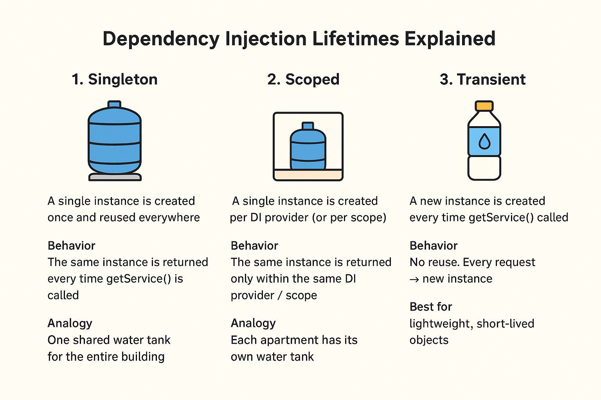
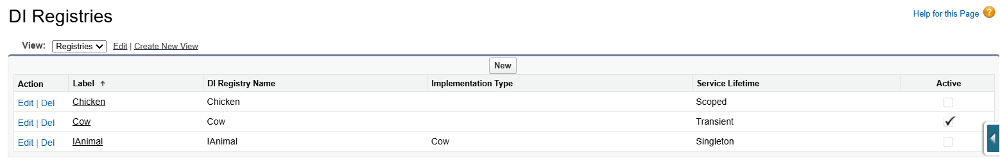
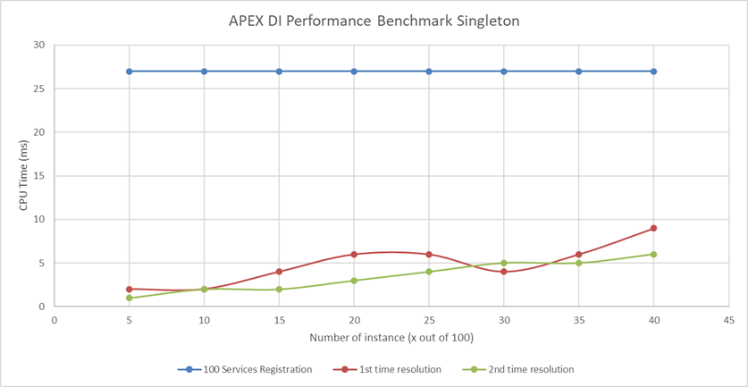
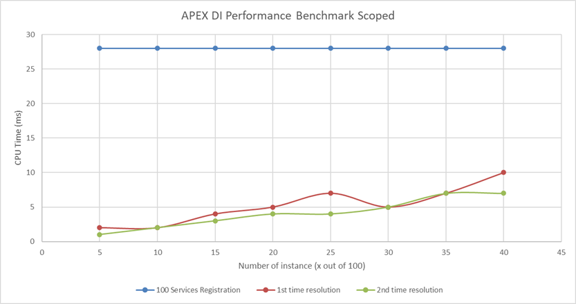
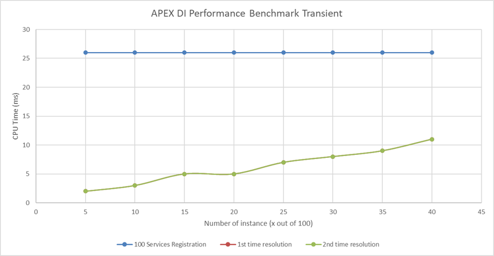

# Apex Dependency Injection (Apex DI)

[](https://github.com/inventronic/apex-di) 
[](https://github.com/inventronic/apex-di)

A lightweight, production-ready Apex dependency injection framework designed to bring modern dependency injection patterns to Salesforce development. Inspired by .NET Core's dependency injection architecture, Apex DI helps you write cleaner, more testable, and more maintainable code.
## Deployment

### Deploy to Salesforce Production / Developer

Click the button below to deploy Apex DI to your Production environment:

[](https://login.salesforce.com/packaging/installPackage.apexp?p0=04tIU000000r90eYAA)

### Deploy to Sandbox

Click the button below to deploy Apex DI to your Sandbox environment:

[](https://test.salesforce.com/packaging/installPackage.apexp?p0=04tIU000000r90eYAA)

## Why Apex DI?

1. **Best Practices for Dependency Injection:**
   - Decouple implementations and program against abstractions
   - Write code that is highly reusable, extensible, and testable
   - Reduce tight coupling between classes

2. **Modular Architecture:**
   - Define boundaries to prevent loading unused services into a module
   - Create dependencies to improve service reusability across modules
   - Organize large projects with clear separation of concerns

3. **High Performance:**
   - Minimal overhead compared to direct class instantiation
   - Optimized service resolution and caching mechanisms
   - Benchmarked and tested at scale

## Table of Contents

- [Quick Start](#quick-start)
- [Core Concepts](#core-concepts)
  - [Service Lifetimes](#service-lifetimes)
  - [Service Registration](#service-registration)
  - [Service Resolution](#service-resolution)
- [Examples](#examples)
- [Performance Benchmarks](#performance-benchmarks)
- [Deployment](#deployment)
- [Development](#development)
- [License](#license)

## Quick Start
### Basic Service Registration and Resolution (Quick Start)

Use the `DI` class as the Global Default Provider. `DI.provider` returns the global provider
(an alias for the framework's global `ServiceProvider`) and `DI.services` exposes the global
`IServiceCollection` for registration. This is the recommended quick-start approach for
project-wide/shared services.

```java
// Quick Start - register services in the Global Default Provider
// (accessible everywhere via DI.getService(...) or DI.provider)
DI.services.addScoped(IError.class, Error.class);
// register account service using factory (AccountService.Factory shown in exampleClasses)
DI.services.addScoped(IAccountService.class, AccountService.Factory.class);

// Resolve from the global provider
IAccountService acct = (IAccountService) DI.getService(IAccountService.class);
acct.run();
```

Notes:
- `DI.services` is the global, default service collection.
- `DI.getService(Type)` and `DI.getService(String)` resolve from the global provider.

### Scope-based Providers (Modules)

For larger projects it is common to create module-scoped `ServiceProvider` instances
so each module has its own service registrations and boundaries. Use independent
`ServiceProvider` instances to represent modules with different implementations or lifetimes.

```java
// Sales module provider
IServiceProvider salesProvider = new ServiceProvider();
salesProvider.services()
    .addScoped(IError.class, Error.class)
    .addScoped(IAccountService.class, AccountService.Factory.class);

// Animals module provider
IServiceProvider animalsProvider = new ServiceProvider();
animalsProvider.services()
    .addScoped(IAnimal.class, Cow.class);

// Resolve inside module boundaries
IAccountService salesSvc = (IAccountService) salesProvider.getService(IAccountService.class);
System.debug(salesSvc.run());

IAnimal cow = (IAnimal) animalsProvider.getService(IAnimal.class);
System.debug(cow.speak());

// Global vs scoped: services registered on `salesProvider` are NOT automatically
// available via `DI.getService(...)` unless you also register them on `DI.services`.
```

## Core Concepts

### Service Lifetimes

Apex DI supports three service lifetime patterns:


*Illustration: Singleton, Scoped and Transient lifetimes and their resolution boundaries.*


#### 1. **Singleton** - Application-Wide Lifetime
The same instance is returned every time you request the service, across the entire application:

```java
IServiceProvider provider = new ServiceProvider();
provider.services()
    .addSingleton(IAnimal.class, Cow.class);

// Both calls return the SAME instance
IAnimal animal1 = (IAnimal) provider.getService(IAnimal.class);
IAnimal animal2 = (IAnimal) provider.getService(IAnimal.class);
System.assertEquals(animal1, animal2); // true
```

#### 2. **Scoped** - Provider-Level Lifetime
The same instance is returned within the same `ServiceProvider` scope, but different instances across different providers:

```java
IServiceProvider provider1 = new ServiceProvider();
provider1.services()
    .addScoped(IAnimal.class, Cow.class);

IServiceProvider provider2 = new ServiceProvider();
provider2.services()
    .addScoped(IAnimal.class, Cow.class);

// Same instance within provider1
IAnimal animal1a = (IAnimal) provider1.getService(IAnimal.class);
IAnimal animal1b = (IAnimal) provider1.getService(IAnimal.class);
System.assertEquals(animal1a, animal1b); // true

// Different instance from provider2
IAnimal animal2 = (IAnimal) provider2.getService(IAnimal.class);
System.assertNotEquals(animal1a, animal2); // true
```

#### 3. **Transient** - New Instance Each Time
A new instance is created every time you request the service:

```java
IServiceProvider provider = new ServiceProvider();
provider.services()
    .addTransient(IAnimal.class, Cow.class);

// Each call creates a NEW instance
IAnimal animal1 = (IAnimal) provider.getService(IAnimal.class);
IAnimal animal2 = (IAnimal) provider.getService(IAnimal.class);
System.assertNotEquals(animal1, animal2); // true
```

### Service Registration

#### Register with Implementation Type
```java
DI.services.addSingleton(IAnimal.class, Cow.class);
```

#### Register with Concrete Type
```java
DI.services.addSingleton(Animal.class);
```

### Service Resolution

```java
// Resolve by Type
IAnimal animal = (IAnimal) DI.getService(IAnimal.class);

// Resolve by Name
IAnimal animalByName = (IAnimal) DI.getService('IAnimal');
```

## Examples

The project includes comprehensive examples in the `scripts/apex/exampleClasses/` directory demonstrating multiple initialization patterns.

### Pattern 1: Factory-Based Implementation

Factory pattern enables explicit constructor injection with maximum control:

```java
// Service Interface
public interface IAccountService {
    IError run();
}

// Service Implementation with private constructor
public with sharing class AccountService implements IAccountService {
    UUID randomUUID = UUID.randomUUID();
    private IError error { get; set; }
    
    // Private constructor - forces factory usage
    private AccountService(IError error) {
        this.error = error;
    }
    
    public IError run() {
        System.debug('AccountService :-> ' + randomUUID.toString());
        System.debug('AccountService :-> error has ' + 
            (error == null ? 'not ' : '') + 'been injected');
        return error;
    }
    
    // Inner Factory class implementing IServiceFactory
    public class Factory implements IServiceFactory {
        public IAccountService initialize(IServiceProvider provider) {
            return new AccountService(
                (IError) provider.getService(IError.class)
            );
        }
    }
}

// Quick Usage - Factory Method
IServiceProvider provider = new ServiceProvider();
provider.services()
    .addScoped(IError.class, Error.class)
    .addScoped(IAccountService.class, AccountService.Factory.class);

IAccountService service = (IAccountService) provider.getService(IAccountService.class);
IError result = service.run();
```

#### Detailed Factory Usage with Different Lifetimes

```java
// Example 1: Singleton Factory
IServiceProvider provider = new ServiceProvider();
provider.services()
    .addSingleton(IError.class, Error.class)
    .addSingleton(IAccountService.class, AccountService.Factory.class);

IAccountService svc1 = (IAccountService) provider.getService(IAccountService.class);
IAccountService svc2 = (IAccountService) provider.getService(IAccountService.class);
System.assertEquals(svc1, svc2); // Same instance - true

// Example 2: Scoped Factory
IServiceProvider provider = new ServiceProvider();
provider.services()
    .addSingleton(IError.class, Error.class)
    .addScoped(IAccountService.class, AccountService.Factory.class);

IAccountService svc1 = (IAccountService) provider.getService(IAccountService.class);
IAccountService svc2 = (IAccountService) provider.getService(IAccountService.class);
System.assertEquals(svc1, svc2); // Same instance within provider scope - true

IServiceProvider provider2 = new ServiceProvider();
provider2.services()
    .addScoped(IAccountService.class, AccountServiceInitializationCode.class);
IAccountService svc3 = (IAccountService) provider2.getService(IAccountService.class);
System.assertEquals(true, svc1 != svc3); // Different instance across providers - true

// Example 3: Transient Factory (new instance each time)
IServiceProvider provider = new ServiceProvider();
provider.services()
    .addTransient(IError.class, Error.class)
    .addTransient(IAccountService.class, AccountService.Factory.class);

IAccountService svc1 = (IAccountService) provider.getService(IAccountService.class);
IAccountService svc2 = (IAccountService) provider.getService(IAccountService.class);
System.assertNotEquals(svc1, svc2); // New instance each time - true
```

### Pattern 2: Direct Initialization Code (Instance Initializer)

Direct initialization pattern uses instance initializer blocks for simpler dependency resolution:

```java
// Service Implementation with Direct Initialization
public with sharing class AccountServiceInitializationCode implements IAccountService {
    UUID randomUUID = UUID.randomUUID();
    private IError error { get; set; }
    
    // Instance initializer block - called before constructor
    {
        error = (IError) DI.getService(IError.class);
    }
    
    public IError run() {
        System.debug('AccountService :-> ' + randomUUID.toString());
        System.debug('AccountService :-> error has ' + 
            (error == null ? 'not ' : '') + 'been injected');
        return error;
    }
}

// Quick Usage - Direct Initialization
IServiceProvider provider = new ServiceProvider();
provider.services()
    .addSingleton(IError.class, Error.class)
    .addTransient(IAccountService.class, AccountServiceInitializationCode.class);

IAccountService service = (IAccountService) provider.getService(IAccountService.class);
IError result = service.run();
```

#### Detailed Direct Initialization Usage with Concrete Classes

```java
// Example 1: Concrete Class with Instance Initializer (Scoped)
IServiceProvider provider = new ServiceProvider();
provider.services()
    .addSingleton(IError.class, Error.class)
    .addScoped(AccountServiceInitializationCode.class);

AccountServiceInitializationCode svc1 = 
    (AccountServiceInitializationCode) provider.getService(AccountServiceInitializationCode.class);
AccountServiceInitializationCode svc2 = 
    (AccountServiceInitializationCode) provider.getService(AccountServiceInitializationCode.class);
System.assertEquals(svc1, svc2); // Same instance - true
System.assertEquals(svc1.accountUUID, svc2.accountUUID); // Same UUID (same instance) - true

// Example 2: Static Initializer Block (for static DI access)
public with sharing class AccountServiceStaticInit implements IAccountService {
    private static IError staticError { get; set; }
    
    static {
        // Note: Only works with global DI.provider
        staticError = (IError) DI.getService(IError.class);
    }
    
    public IError run() {
        return staticError;
    }
}

// Usage
IServiceProvider provider = new ServiceProvider();
provider.services()
    .addSingleton(IError.class, Error.class);

IAccountService service = new AccountServiceStaticInit();
IError result = service.run();

// Example 3: Combined Approach (Interface + Concrete + Different Lifetimes)
IServiceProvider provider = new ServiceProvider();
provider.services()
    .addSingleton(IError.class, Error.class)
    .addScoped(IAccountService.class, AccountServiceInitializationCode.class);

IAccountService svc1 = (IAccountService) provider.getService(IAccountService.class);
IAccountService svc2 = (IAccountService) provider.getService(IAccountService.class);
System.assertEquals(svc1, svc2); // Same scoped instance - true
```

### Pattern 3: Animal Service with Polymorphism

```java
// Interface
public interface IAnimal {
    String speak();
}

// Concrete Implementations
public without sharing class Cow implements IAnimal {
    UUID randomUUID = UUID.randomUUID();
    public String speak() {
        return 'Moo ' + randomUUID.toString();
    }
}

public without sharing class Chicken implements IAnimal {
    UUID randomUUID = UUID.randomUUID();
    public String speak() {
        return 'Cluck Cluck ' + randomUUID.toString();
    }
}

// Quick Usage - Polymorphic Resolution
IServiceProvider provider = new ServiceProvider();
provider.services()
    .addScoped(IAnimal.class, Cow.class);

IAnimal animal = (IAnimal) provider.getService(IAnimal.class);
System.debug(animal.speak()); // Output: Moo [UUID]

// Override with different implementation
IServiceProvider provider2 = new ServiceProvider();
provider2.services()
    .addScoped(IAnimal.class, Chicken.class);

IAnimal animal2 = (IAnimal) provider2.getService(IAnimal.class);
System.debug(animal2.speak()); // Output: Cluck Cluck [UUID]
```

#### Advanced Multi-Provider Pattern

```java
// Global DI Provider - Singleton lifetime
DI.services.addScoped(Chicken.class, Chicken.class);

// Scoped Provider 1 - Scoped lifetime
IServiceProvider provider1 = new ServiceProvider();
provider1.services().addScoped(IAnimal.class, Cow.class);

IAnimal animal1a = (IAnimal) provider1.getService(IAnimal.class);
IAnimal animal1b = (IAnimal) provider1.getService(IAnimal.class);
System.assertEquals(animal1a, animal1b); // Same instance within provider1 - true

// Scoped Provider 2 - Transient lifetime
IServiceProvider provider2 = new ServiceProvider();
provider2.services().addTransient(IAnimal.class, Chicken.class);

IAnimal animal2a = (IAnimal) provider2.getService(IAnimal.class);
IAnimal animal2b = (IAnimal) provider2.getService(IAnimal.class);
System.assertNotEquals(animal2a, animal2b); // Different instances - true

// Global DI access
IAnimal animalGlobal1 = (Chicken) DI.getService(Chicken.class);
IAnimal animalGlobal2 = (Chicken) DI.getService(Chicken.class);
System.assertEquals(animalGlobal1, animalGlobal2); // Same singleton instance - true
```

### Pattern 4: Service Registration Rules (No Re-registration)

This implementation of Apex DI does not allow re-registering the same service within the same
provider scope or globally when a singleton is already registered. Attempting to register a
service that already exists (same service key and lifetime) will throw an error such as:

- `IAnimal with Singleton lifetime is already registered in global services.`
- `IAnimal with Singleton lifetime is already registered in services.`

If you need a different implementation, use one of these safe approaches instead of re-registering:

1. Module / Scoped Provider: create a new `ServiceProvider` for the module and register the
   alternate implementation there. This keeps boundaries clear and avoids conflicts.

```java
// Create a module-scoped provider with a different implementation
IServiceProvider animalsModule = new ServiceProvider();
animalsModule.services().addScoped(IAnimal.class, Chicken.class);

IAnimal a = (IAnimal) animalsModule.getService(IAnimal.class);
System.debug(a.speak()); // Cluck
```

2. Registry Groups: use `DI_Registry__mdt` custom metadata to declare service mappings. The
   framework exposes a helper on `IServiceCollection` called `loadRegistries()` which reads
   all active `DI_Registry__mdt` entries and registers them on the current `IServiceCollection`.

```java
// Load all active registry entries from DI_Registry__mdt into the global collection
//DI.services.loadRegistries(); // For Global Service we do not even need to call this method, as it automatically runs.

// Resolve from the global provider (providers are created/available when services are resolved)
IAnimal alt = (IAnimal) DI.getService(IAnimal.class);
```

3. Recreate provider after changing registrations: instead of adding to an existing provider,
   adjust the `IServiceCollection` (or use a fresh one). After registration you can resolve
   services directly (providers are created/available when services are first requested), or
   create a fresh `ServiceProvider()` if you prefer an explicit, separate scope.

```java
// Option A: Update the global collection then resolve (global provider is available)
IServiceCollection sc = DI.services; // modifies global collection
sc.addScoped(IAnimal.class, Cow.class);
IAnimal newAnimal = (IAnimal) DI.getService(IAnimal.class);
System.debug(newAnimal.speak());

// Option B: Create a fresh provider/scope and register there instead
IServiceProvider newProvider = new ServiceProvider();
newProvider.services().addScoped(IAnimal.class, Chicken.class);
IAnimal newAnimalFromNewProvider = (IAnimal) newProvider.getService(IAnimal.class);
System.debug(newAnimalFromNewProvider.speak());
```

Do not attempt to call `.addScoped(...)` or `.addSingleton(...)` with the same service key
on a provider that already contains that registration — the framework will raise an error.

### Comparison: Factory vs Direct Initialization

| Aspect | Factory Pattern | Direct Initialization |
|--------|-----------------|----------------------|
| Constructor Control | Private constructor, strict control | Public/default constructor |
| Flexibility | Maximum flexibility for custom logic | Simple, straightforward |
| Best For | Complex initialization, multiple dependencies | Simple services, minimal logic |
| Performance | Slight overhead from factory method | Direct instantiation (faster) |
| Testing | Easy to mock factory behavior | Easy to test concrete class |
| Dependency Order | Explicit control via factory | Order determined by initializer |
| Code Clarity | More boilerplate, very explicit | Less code, less explicit |

## Advanced Patterns

The `DIExample` class demonstrates advanced multi-provider and lifetime combination patterns:

### Example 1: Global vs Scoped Providers

```java
// Register in global DI provider
DI.services.addScoped(Chicken.class, Chicken.class);

// Create scoped provider
IServiceProvider provider = new ServiceProvider();
provider.services().addScoped('Cow');

// Get from different providers
IAnimal globalAnimal = (Chicken) DI.getService(Chicken.class);
IAnimal scopedAnimal = (Cow) provider.getService(Cow.class);

// Scoped instances vs global instances follow lifetime rules
IAnimal globalAnimal2 = (Chicken) DI.getService(Chicken.class);
System.assertEquals(globalAnimal, globalAnimal2); // Both exists in the global scope which is same - true
```

### Example 2: Mixed Lifetimes in Single Provider

```java
IServiceProvider provider = new ServiceProvider();
provider.services()
    .addSingleton(IError.class, Error.class)        // Singleton - reused everywhere
    .addScoped('IAnimal', 'Cow')             // Scoped - same within provider
    .addTransient(IAccountService.class, AccountService.Factory.class); // Transient - new each time

IError err1 = (IError) provider.getService(IError.class);
IError err2 = (IError) provider.getService(IError.class);
System.assertEquals(err1, err2); // Singleton - true

IAccountService svc1 = (IAccountService) provider.getService(IAccountService.class);
IAccountService svc2 = (IAccountService) provider.getService(IAccountService.class);
System.assertNotEquals(svc1, svc2); // Transient - true
```

### Example 3: Factory-Based Services with Mixed Dependencies

```java
IServiceProvider provider = new ServiceProvider();
provider.services()
    .addScoped(IError.class, Error.class)           // Scoped dependency
    .addScoped(IAccountService.class, AccountService.Factory.class); // Scoped factory

// Both calls return same factory instance due to Scoped lifetime
IAccountService svc1 = (IAccountService) provider.getService(IAccountService.class);
IAccountService svc2 = (IAccountService) provider.getService(IAccountService.class);
System.assertEquals(svc1, svc2); // Same scoped instance - true

// But the injected dependencies follow their own lifetime rules
// If IError is singleton, all services get same error instance
// If IError is scoped, services within scope share same error
```

### Example 4: Cross-Provider Singleton Sharing

```java
// Register singleton in global provider
DI.services.addScoped(IError.class, Error.class);
DI.services.addTransient(IAccountService.class, AccountService.Factory.class);

// Create separate scoped providers
IServiceProvider provider1 = new ServiceProvider();
IServiceProvider provider2 = new ServiceProvider();

// Get services from different providers
IAccountService svc1 = (IAccountService) provider1.getService(IAccountService.class);
IAccountService svc2 = (IAccountService) provider2.getService(IAccountService.class);

// They get different AccountService instances (transient in global)
// But they share the same instance (singleton in global)
System.assertNotEquals(svc1, svc2); // Transient - true

```

## DI Registry (Custom Metadata)

Apex DI supports loading service registrations from a custom metadata type named `DI_Registry__mdt`.
This enables non-code configuration of service mappings and lifetimes so admins can manage
which concrete implementation is used for an interface or service name.


*DI Registry UI example — use custom metadata records to map service keys to implementation types and lifetimes.*

Key fields on `DI_Registry__mdt` (see `force-app/main/default/objects/DI_Registry__mdt/fields/`):
- `Implementation_Type__c` (Text, required for mapping) — the implementation class name (e.g. `Cow` or `MyNamespace.Cow`).
- `Service_Lifetime__c` (Picklist: `Scoped`, `Singleton`, `Transient`) — lifetime for the service.
- `Active__c` (Checkbox) — enable/disable the registry entry.

Recommended naming convention:
- Use the `DeveloperName` (and/or `MasterLabel`) as the service key with an optional group prefix,
    for example `DITest.IAnimal` or `DITest.AccountService`. The registry loader uses the
    `DeveloperName` value as the service key when registering. If you need grouping semantics,
    include a prefix in `DeveloperName` (for example `DITest::Group1.IAnimal`) and filter records
    yourself before registering (see note below).

Example registry record (conceptual):

- `DeveloperName`: `DITest.IAnimal`
- `MasterLabel`: `DITest.IAnimal`
- `Implementation_Type__c`: `DITest.Cow`  (Apex class name)
- `Service_Lifetime__c`: `Scoped`
- `Active__c`: `true`

Loading services from the registry in code:

```java
// Load all active DI_Registry__mdt entries into the global collection
// DI.services().loadRegistries(); //Internally it gets called for the global provider and services. No need to call this expicitly

// Resolve services via the global provider
IAnimal animalFromGlobalProvider = (IAnimal) DI.getService(IAnimal.class);
```

Load a specific subgroup or multiple groups (filter manually):

The built-in `loadRegistries()` method registers all active `DI_Registry__mdt` records. 

Authoring registry records:
- You can create `DI_Registry__mdt` records in Setup (Custom Metadata Types) or deploy them
    via source control (place custom metadata under `force-app/main/default/customMetadata/`).
- Use `DeveloperName` to include a group prefix so you can selectively register records (see manual example above).

Notes:
- Only active entries (`Active__c = true`) are loaded.
- `Implementation_Type__c` must point to a valid Apex class or a factory type if using factory-based initialization.
- When using factory entries, append factory class name (e.g. `AccountService.Factory`) in `Implementation_Type__c`.

## Performance Benchmarks

Apex DI has been thoroughly benchmarked to ensure production-readiness. The framework demonstrates minimal overhead:

### Benchmark Results


*Singleton services show negligible resolution cost after initialization*


*Scoped services maintain consistent performance within provider boundaries*


*Transient services are lightweight and suitable for high-frequency instantiation*

### Key Findings

1. **Service registration with class names** is the fastest solution compared to strong class types (minimal overhead)
2. **Interfaces and abstractions** can be used freely without performance impact (best practice)
3. **Transient lifetime** is suitable for frequent instantiation (constructor reuse is optimized)
4. **Modular organization** with services per module (limit to ~100 services per module for optimal performance)

## License

This project is licensed under the MIT - see the [LICENSE](LICENSE) file for details.

---

**Version:** 1.0.0 | **Updated:** November 2025
